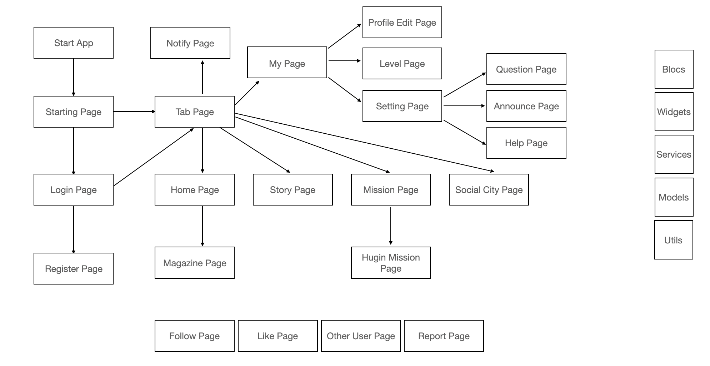
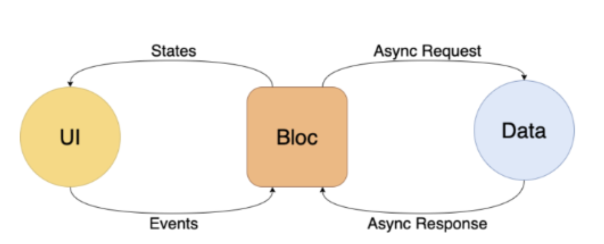

# Welcome to Younhong's Github Page
> This page is guide document page for Hugin Project.
Only part of source code that explains new functions will be shown since it is a private code for company.

# About Hugin
> Hugin started out from a movie called ‘Pay It Forward’. Main motivation of hugin company is that one's person's good act makes the whole world bright by passing benefits to each other.

# Project Structure of Hugin Project
* Hugin App
  > Hugin Mobile Application developed with flutter framework with dart language. It supports both android and ios mobile devices.
* Hugin Web
  > Hugin Web Application developed with flutte framework with dart language. Flutter Web provides functions for converting dart language to javascript language.
* Hugin Server
  > Hugin Project is connected to cloud function which is provided by google cloud platform which consists firebase database system. Cloud Function mainly works with the nodejs and typescript language.
* Database
  > Hugin Application is connected to firebase database system, which is nosql database. Flutter provides a lot of plugins to support connection to firebase database system.
  
# Other tools for project
* Gitlab
   > Gitlab is very nice tool for managing source code. It is similar to github, but unlike github, gitlab is provides better enviroment for developing with team with private repository. Our project manages three project in gitlab each for app, web, and server.
* Slack
  > Slack is very useful tool for communcating with developers. Also, slack provides notification channel connected with gitlab which means all the commits of gitlab can be notified and shown on slack.
* Zeplin
  > Zeplin is a tool for designer. It is similar to figma. By using zeplin, you can design application first and apply it on your application.
  
# App Structure of Hugin Projects


# What's New in Hugin Project 2020?
```html
New Features for Hugin Project

  Mobile App
    1. Bloc Pattern (with flutter bloc)
    2. Level Up System
    3. Mission Invitation
    4. Social City
    5. Theme Exhibition
    6. Magazine
    7. Tutorial Mode
    8. Apple Login

  Server
    1. Deleting all user data when user leaves the app
    2. Notification Message for like/comment/announcement

  Web
    1. User Management
    2. Mission Management
    3. Story Management
    4. Theme Management
    5. Announce/Help Management
    6. Report Management
    7. Banner Management

```

# Why Using Bloc Pattern?

> Bloc Pattern is a design pattern that manages state of application. By using bloc pattern, you can manage status of application very efficient.   
> Let's say if you have 100 widgets in one page. On the press of one button, you only want to change one widget. However, if you do not use any design pattern, you have to render whole page which includes 100 widgets. It is very inefficient since you only want to change 1 part of page. By using bloc pattern, you can set status for each widgets, and change only status of widget you want to give modification rather than rebuilding whole page.   
> For the state management of application, there are  many options like provider pattern, bloc pattern or redux pattern. From those options, we chose to use bloc pattern.   
> Flutter provides plugin for bloc pattern which helps developers to approach easily.

# Application Link
> [Android: https://play.google.com/store/apps/details?id=com.swfact.hugin](https://play.google.com/store/apps/details?id=com.swfact.hugin)   
> [IOS: https://apps.apple.com/kr/app/hugin/id1477161344](https://apps.apple.com/kr/app/hugin/id1477161344)


# Contact
> If you have any questions regarding this project, please contact [younhong@kakao.com](younhong@kakao.com)
